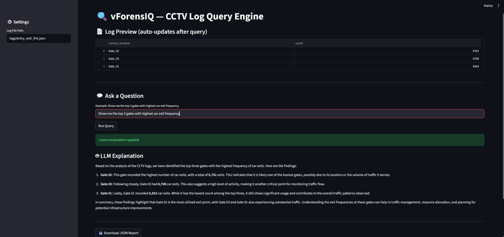
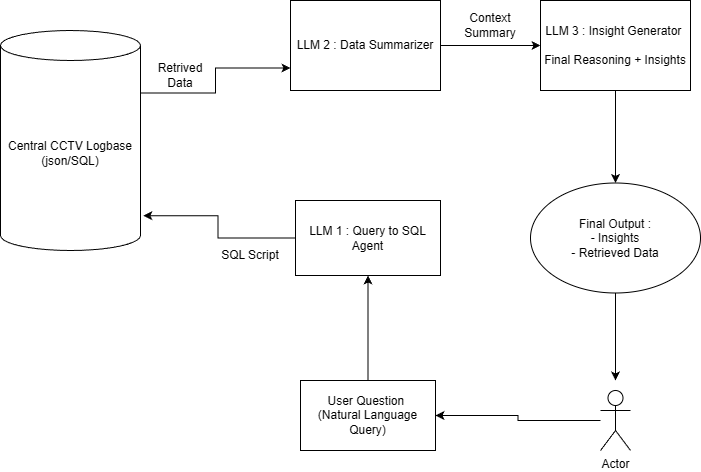

# vForensIQ
Smart Video Footage Analysis with Computer Vision and LLM

vForensIQ is an intelligent surveillance analytics system that combines **Computer Vision (CV)** for CCTV event detection with **Large Language Models (LLMs)** for reasoning, querying, and insight generation over structured surveillance logs.

---

## Demo

---

## LLM Reasoning

The LLM layer acts as the core intelligence of the system. It translates human natural-language queries into structured database operations, performs temporal and spatial reasoning over historical logs, and generates meaningful summaries and forensic insights.

---
