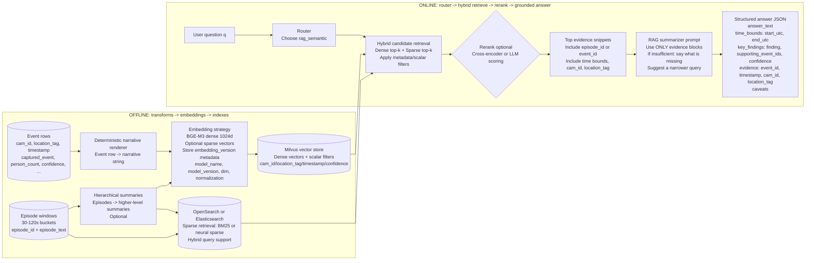

# vForensIQ
Smart Video Footage Analysis with Computer Vision and LLM

vForensIQ is an intelligent surveillance analytics system that combines **Computer Vision (CV)** for CCTV event detection with **Large Language Models (LLMs)** for reasoning, querying, and insight generation over structured surveillance logs.

---

## Demo


---

## LLM Reasoning

The LLM layer acts as the core intelligence of the system. It translates human natural-language queries into structured database operations, performs temporal and spatial reasoning over historical logs, and generates meaningful summaries and forensic insights.


---

## NL->SQL Engine (Event-Context Aware)

The repository now includes an event-context NL->SQL pipeline powered by the canonical source:

- `Data/Augmented_Data/out/data.csv`

Key behavior:

- Natural language -> QueryPlan -> SQL (read-only)
- SQLite execution with hourly rollup support
- Chunked summarization partitioned by `captured_event`
- Separate per-event summaries (no mixed-event narrative unless user asks to compare)
- Answer-first output in normal language
- Downloadable processed evidence tables (CSV/JSON)
- SQL citation list for both primary and post-processing queries
- Provider mode: `openai` only

### Models and Logging

- OpenAI SQL model: `OPENAI_SQL_MODEL` (default: `gpt-3.5-turbo`, set to any higher model as needed)
- Pipeline log file: `logs/nl_sql_pipeline.log`
- Audit log file: `logs/query_audit.jsonl`

### Run Streamlit UI

```bash
streamlit run app.py
```

### Run CLI

```bash
python chat.py
```

### Tests

```bash
python -m unittest discover -s tests -p "test_event_context_pipeline.py"
```

